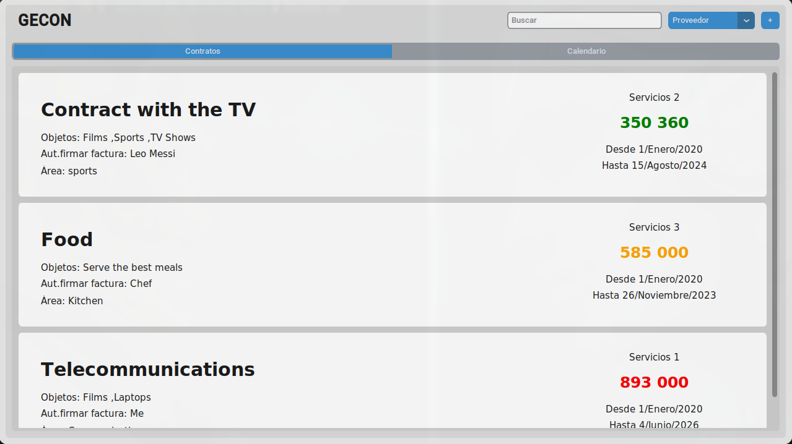
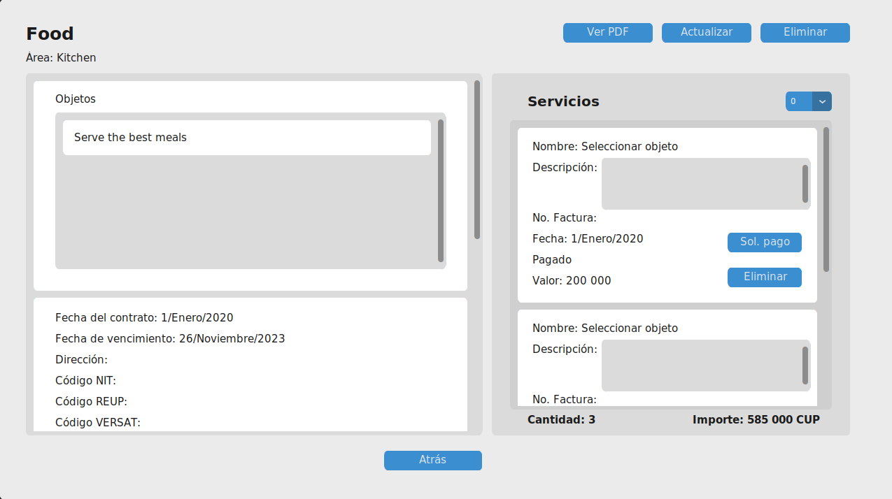
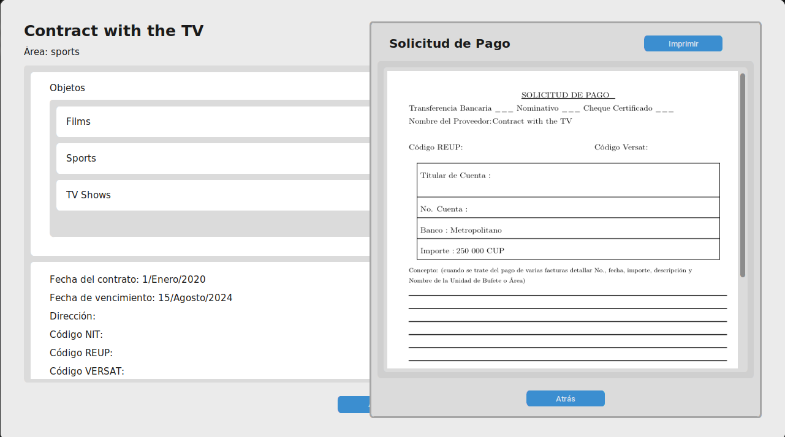
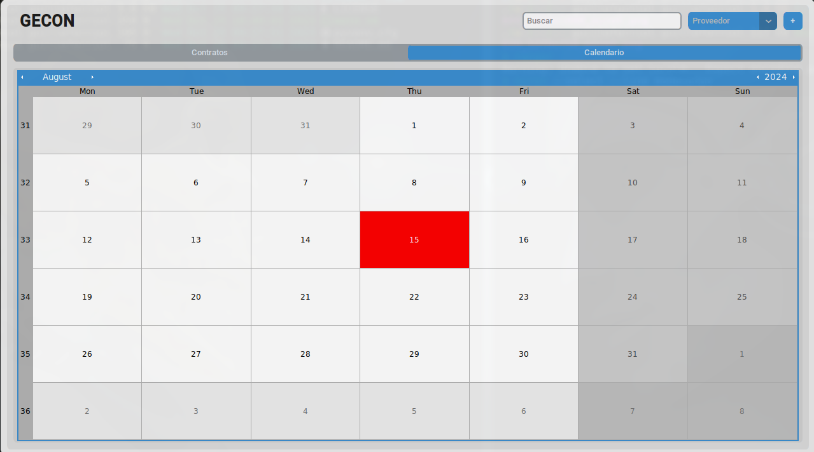

# contracts-app
GECON, an application to manage contracts in Collective Law Firms.

#### Execution

```
sh main.sh
```
You don't need to install anything, it is in a virtual environment.

#### Main Frame
All contracts in the database are displayed here, with their main information. In the upper left corner there is the search bar, the sorting menu for each field shown in the contracts and a button with a "+" to add a new contract 



#### Frame where the contract data will be filled
This frame will be displayed when you touch the "+" button in the main frame. Here add new contracts or recover those that have been deleted either because they expired or because an administrator deleted them.


### View all data of existing contracts
When it is added or retrieved it is inserted into the main database which is displayed in the Main Frame. When you tap on one of these contracts you can see all the data it contains. 



### Autogenerated pdf
If you touch the "sol. pago" button in each service of the contract, a pdf is generated with all its data to print immediately



### Calendar 
In the calendar you can see all the days on which the contracts expire to keep track of their renewal. These will be automatically deleted when the expiration date is equal to the current date.



These are the main functionalities, but it has many others, such as viewing the pdf of the contract, updating data and services, etc...


